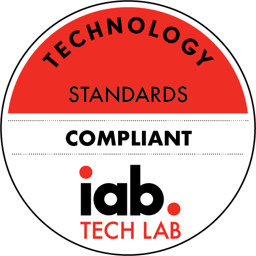

# OpenX Apollo iOS SDK

Apollo SDK is a part of OpenX Apollo platform which implements an In-App Bidding approach and gives opportunities to buyers to compete on your inventory at parallel bidding auctions. 

The current SDK version is **1.2.0**.
Go to [release notes](info/ios-in-app-bidding-release-notes.md) for all SDK versions.


> **_NOTE:_**  The documentation for the legacy OpenX SDK is available [here](legacy-sdk/LEGACY_SDK_README.md).

## Quick Start

#### CocoaPods integration

To download and integrate the SDK into your project using CocoaPods, add the following line to your project’s podfile:

```
pod 'openx-apollo-sdk'
```

If you integrate Apollo with GAM or MoPub add these pods respectively

```
# + Google Ad Manager (optional)
pod 'openx-apollo-gam-event-handlers'

# + MoPub (optional)
pod 'openx-apollo-mopub-adapters'
```

#### Download SDK and demo applications

Also, you can download and integrate all needed components manually:

- [Apollo SDK](http://sdk.prod.gcp.openx.org/apollo/ios/sdk/1.2.0/OpenX_Apollo_SDK_iOS_1.2.0.zip)
- [GAM Event Handlers](http://sdk.prod.gcp.openx.org/apollo/ios/event-handlers/GAM/1.2.0/OpenX_Apollo_GAMEventHandlers_iOS_1.2.0.zip)
- [MoPub Adapters](http://sdk.prod.gcp.openx.org/apollo/ios/event-handlers/MoPub/1.2.0/OpenX_Apollo_MoPub_Adapters_iOS_1.2.0.zip)
- [Demo Application](http://sdk.prod.gcp.openx.org/apollo/ios/demo/1.2.0/OpenX_Apollo_DemoApp_iOS_1.2.0.zip)


## Apollo SDK Overview

For the overview of the In-App Bidding technology, see [Getting started with In-App Bidding](info/ios-in-app-bidding-getting-started.md).

Here are key capabilities of the iOS In-App Bidding SDK:

-   **Integration Scenarios**
    - [Google Ad Manager](info/integration-gam/ios-in-app-bidding-gam-info.md)
    - [MoPub](info/integration-mopub/ios-in-app-bidding-mopub-info.md)
    - [Pure In-App Bidding](info/integration-pb/ios-in-app-bidding-pb-info.md)





-   **Support of these premium ad formats:**
    -   Banner
    -   Display Interstitial
    -   Video Interstitial
    -   [**NEW**] [Native](info/ios-in-app-bidding-native-guidelines-info.md) 
    -   Rich media and MRAID 3.0 support
    -   Rewarded Video
    -   Outstream Video
-   **Open Measurement Support**. The In-App Bidding SDK is based on the former OpenX SDK which is certificated with IAB, IAS and MOAT.
-   **Direct SDK integration**. Allows you to pass first-party app data,
    user data, device data, and location data.  
-   **Privacy Regulation Compliance**. The In-App Bidding SDK meets **GDPR**, **CCPA**, **COPPA** requirements according to the IAB specifications.
-   **App targeting campaigns**. With the [support of deeplink+](info/ios-sdk-deeplinkplus.md) SDK is able to manage the ads with premium UX for retargeting campaigns.
-    **Targeting**. Use [custom ad parameters](info/ios-sdk-parameters.md) to increase the chance to win an impression and to improve ad views' UX.
-   **Tracking of render impression**. The OpenX In-App Bidding SDK tracks [render impressions](info/ios-sdk-impression-tracking.md) according to the IAB Measurement Guidelines for all managed ads. Ads rendered by Primary Ad Server SDK track an impression beacon according to the internal algorithms.
-   **Demo app** that serves as an implementation guide and test environment.
-   **Fast and seamless integration.**


## Contact Us

If you have any questions or need help, go to [Apollo Support](https://www.openx.com/prebid/#form).
