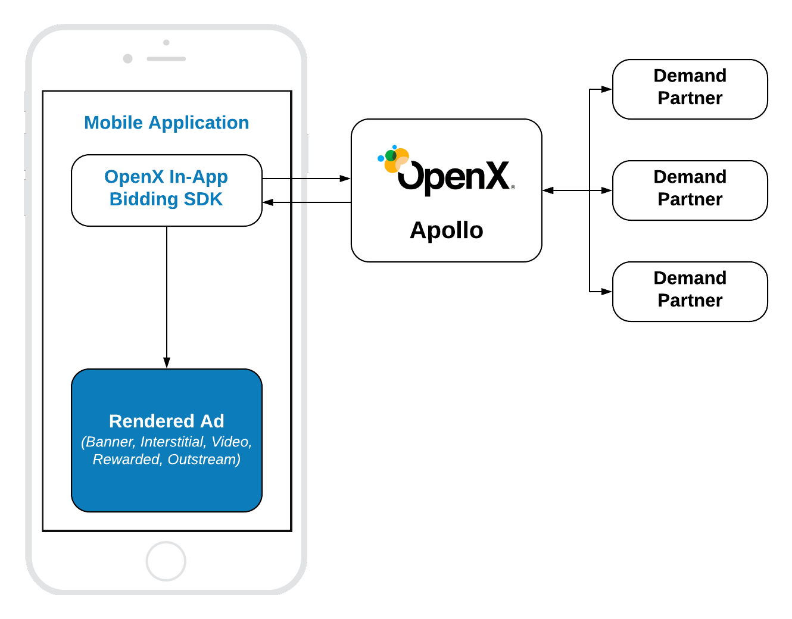

# Pure In-App Bidding Integration

## Table of Contents

2. [Order setup](#Order-setup)
3. [Mobile API](#Mobile-API)
    - [Init SDK](#Init-In-App-Bidding-SDK)
    - [Banner](#Banner-API)
    - [Interstitial](#Interstitial-API)
    - [Rewarded](#Rewarded-API)

## Mobile API

The integration of Pure In-App Bidding is similar to the integration of any other regular Ad SDK. The only difference is that the header bidding auction will be run at the backend instead of the Ad Server auction.




OpenX In-App Bidding SDK provides ability to integrate header bidding for these ad kinds:

- Display Banner
- Display Interstitial
- [Native Styles](../integration-apollo/ios-in-app-bidding-apollo-native-integration.md)
- Video Interstitial 
- Rewarded Video
- Outstream Video

However, OpenX In-App Bidding facade provides only three kinds of API classes for these ads:

- **Banner API** - for **Display Banner** 
- **Interstitial API** - for **Display** and **Video** Interstitials
- **Rewarded API** - for **Rewarded Video**

To create an Apollo account and start to use the SDK, visit the [OpenX Apollo](https://www.openx.com/prebid/) page first.

### Banner API

To display an ad you need to implement three easy steps:


``` swift
// 1. Create an Ad View
let banner = OXABannerView(frame: CGRect(origin: .zero, size: adSize),
                           configId: APOLLO_CONFIG_ID,
                           adSize: adSize)
    
banner.delegate = self
    
// 2. Load an Ad
banner.loadAd()
```

#### Step 1: Create Ad View

In the Pure In-App Bidding scenario you just need to initialize the Banner Ad View with correct properties:

- **frame** - the frame rectangle for the view
- **configId** - an ID of Stored Impression on the Apollo server
- **size** - the size of the ad unit which will be used in the bid request.

And assign the [delegate](../ios-in-app-bidding-delegates.md) for processing ad events.

#### Step 2: Load the Ad

Simply call `loadAd()` and SDK will:

- make a bid request to Apollo
- render the winning bid on display

#### Outstream Video

For **Outstream Video** you also need to specify the kind of expected ad:

``` swift
banner.adFormat = .video
```

### Interstitial API

To display an ad you need to implement these easy steps:


``` swift
// 1. Create an Interstitial Ad Unit
interstitial = OXAInterstitialAdUnit(configId: APOLLO_CONFIG_ID,
                                     minSizePercentage: CGSize(width: 30, height: 30))
    
interstitial.delegate = self
    
// 2. Load an Ad
interstitial.loadAd()

// .....

// 3. Show An Ad
if interstitial.isReady {
    interstitial.show(from: self)
}

```

The way of displaying **Video Interstitial Ad** is almost the same with two differences:

- Need customize the ad unit kind
- No need to set up `minSizePercentage`

``` swift

// 1. Create an Interstitial Ad Unit
let interstitial = OXAInterstitialAdUnit(configId: APOLLO_CONFIG_ID)
    
interstitial.adFormat = .video
interstitial.delegate = self
    
// 2. Load an Ad
interstitial.loadAd()

// .....

// 3. Show An Ad
if interstitial.isReady {
    interstitial.show(from: self)
}

```


#### Step 1: Create an Ad Unit


In the Pure In-App Bidding scenario you just need to initialize the Banner Ad View with correct properties:

- **configId** - an ID of Stored Impression on the Apollo server
- **minSizePercentage** - specifies the minimum width and height percent an ad may occupy of a device’s real estate.

Also you can assign the [delegate](../ios-in-app-bidding-delegates.md) for processing ad events.

> **NOTE:** minSizePercentage - plays an important role in a bidding process for display ads. If provided space is not enough demand partners won't respond with the bids.

#### Step 2: Load the Ad

Simply call the `loadAd()` method to start [In-App Bidding](../ios-in-app-bidding-getting-started.md) flow.


#### Step 3: Show the Ad when it is ready


The most convenient way to determine if the ad is ready for displaying is to subscribe to the particular [delegate](../ios-in-app-bidding-delegates.md) method:

``` swift
// MARK: OXAInterstitialAdUnitDelegate
    
func interstitialDidReceiveAd(_ interstitial: OXAInterstitialAdUnit) {
    // Now the ad is ready for display
}
```

However, due to the expiration, the ad could become invalid with time. So it is always useful to check it with `interstitial?.isReady` before display.


### Rewarded API

To display an ad you need to implement these easy steps:


``` swift
// 1. Create an Ad Unit
rewardedAd = OXARewardedAdUnit(configId: APOLLO_CONFIG_ID)
rewardedAd.delegate = self
    
// 2. Load an Ad
rewardedAd.loadAd()

/// .......

// 3. Display the Ad
if rewardedAd.isReady {
    rewardedAd.show(from: self)
}
```

To be notified when a user earns a reward - implement the method of `OXARewardedAdUnitDelegate`. Now this method will be called when the ad is completed. 

``` swift
func rewardedAdUserDidEarnReward(_ rewardedAd: OXARewardedAdUnit) {
}
```


#### Step 1: Create Rewarded Ad Unit

Create the **OXARewardedAdUnit** object with parameter:

- **ApolloAdUnitId** - an ID of Stored Impression on the Apollo server

#### Step 2: Load the Ad

Simply call the `loadAd()` method to start [In-App Bidding](../ios-in-app-bidding-getting-started.md) flow.


#### Step 3: Show the Ad when it is ready


The most convenient way to determine if the ad is ready for displaying is to subscribe to the particular [delegate](../ios-in-app-bidding-delegates.md) method:

``` swift
// MARK: OXARewardedAdUnitDelegate
    
func rewardedAdDidReceiveAd(_ rewardedAd: OXARewardedAdUnit) {
    // Now the ad is ready for display
}   
```


