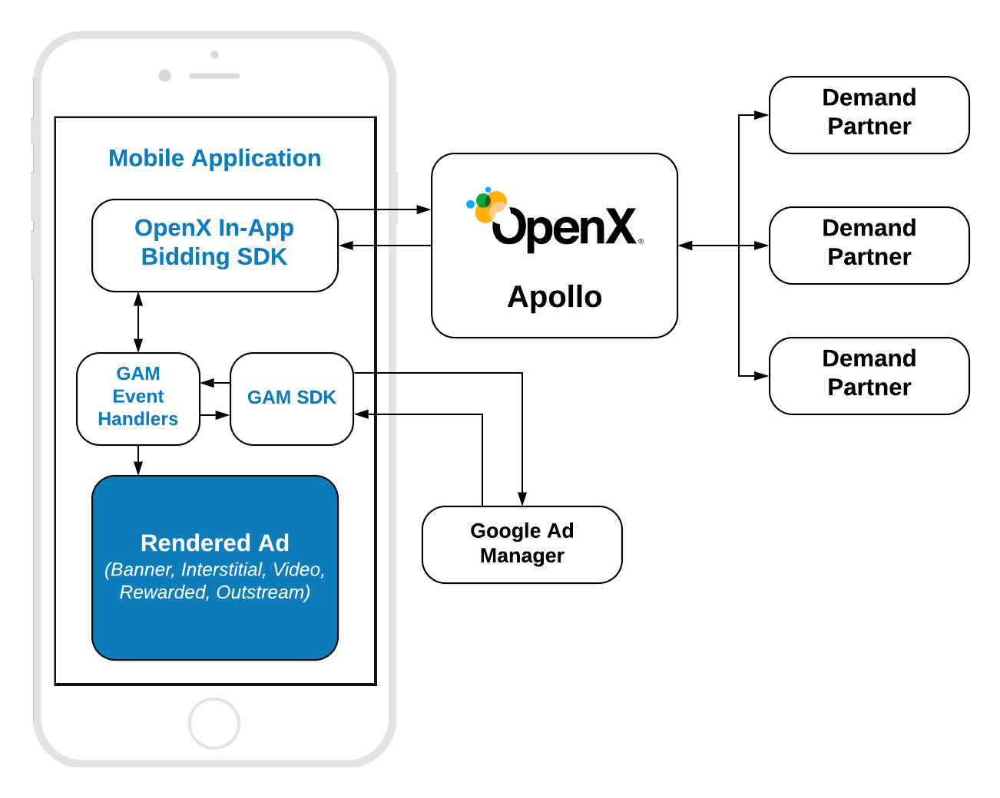

# Google Ad Manager Integration

## Table of Contents

1. [SDKs integration](#SDKs-integration)
2. [Order setup](#Order-setup)
3. [Mobile API](#Mobile-API)
    - [Init SDK](#Init-In-App-Bidding-SDK)
    - [Banner](#Banner-API)
    - [Interstitial](#Interstitial-API)
    - [Rewarded](#Rewarded-API)


## GAM SDK Integration

The prerequisite of In-App Bidding integration with Google Ad Manager (GAM or DFP) is an installed GAM SDK. If you do not have GAM SDK in the app yet, refer the [Google Documentation](https://developers.google.com/ad-manager/mobile-ads-sdk/ios/quick-start) about the integration process. The In-App Bidding SDK was tested with GAM SDK 7.61.0. If you have any trouble with this or other versions, please, contact the [OpenX Support](https://docs.openx.com/Content/support.html).


## Order Setup 

To integrate header bidding with GAM you have to prepare a specific Order following the [instructions](ios-in-app-bidding-gam-order-setup.md) for particular ad kind.

## Mobile API



OpenX In-App Bidding SDK provides an ability to integrate header bidding for these ad kinds:

- Display Banner
- Display Interstitial
- Video Interstitial 
- Rewarded Video
- Outstream Video

However, OpenX In-App Bidding GAM facade provides only three types of API classes for these ads:

- **Banner API** - for **Display Banner** and **Outstream Video**
- **Interstitial API** - for **Display** and **Video** Interstitials
- **Rewarded API** - for **Rewarded Video**

To create an Apollo account and start to use the SDK, visit the [OpenX Apollo](https://www.openx.com/prebid/) page first.

### Event Handlers

GAM Event Handlers is a set of classes that wrap the GAM Ad Units and manage them respectively to the In-App Bidding flow. These classes are provided in the form of framework that could be added to the app via CocoaPods:

```
pod 'openx-apollo-gam-event-handlers'
```

Or you can [download](http://sdk.prod.gcp.openx.org/apollo/ios/event-handlers/GAM/1.0.0/OpenX_Apollo_GAMEventHandlers_iOS_1.0.0.zip) it manually and add as any other regular framework


### Init In-App Bidding SDK

To start running bid requests you have to provide an **Account Id** for your organization on Apollo server to the SDK:

```
OXASDKConfiguration.singleton.accountID = YOUR_ACCOUNT_ID
```

The best place to do it is the `application:didFinishLaunchingWithOptions` method. 

> **NOTE:** The account ID is an identifier of the **Stored Request** of your organization in the Apollo UI. 


### Banner API

To integrate a banner ad you need to implement three easy steps:


``` swift
// 1. Create an Event Handler
let eventHandler = OXAGAMBannerEventHandler(adUnitID: GAM_AD_UNIT_ID,
                                            validGADAdSizes: [NSValueFromGADAdSize(adSize)])
       
// 2. Create a Banner View
let banner = OXABannerView(configId: APOLLO_CONFIG_ID,
                           eventHandler: eventHandler)
banner.delegate = self

addBannerToUI(banner: banner)
        
// 3. Load an Ad
banner.loadAd()
```

#### Step 1: Create Event Handler

GAM event handlers are special containers that wrap GAM Ad Views and help to manage collaboration between GAM and OpenX views.

**Important:** you should create and use a unique event handler for each ad view.

To create the event handler you should provide a GAM Ad Unit Id and the list of available sizes for this ad unit.


#### Step 2: Create Ad View

**OXABannerView** - is a view that will display the particular ad. It should be added to the UI. To create it you should provide:

- **configId** - an ID of Stored Impression on the Apollo server
- **eventHandler** - the instance of the banner event handler

Also, you should add the instance of `OXABannerView` to the UI.

And assign the [delegate](../ios-in-app-bidding-delegates.md) for processing ad events.


#### Step 3: Load the Ad

Simply call the `loadAd()` method to start the [In-App Bidding](../ios-in-app-bidding-getting-started.md) flow. The In-App Bidding SDK will start the bidding process right away.

#### Outstream Video

For **Outstream Video** you also need to specify the kind of expected ad:

``` swift
banner.adFormat = .video
```

And all the rest code will be the same as for integration of display banner.


### Interstitial API

To integrate interstitial ad you need to implement four easy steps:


``` swift
// 1. Create Event Handler
let eventHandler = OXAGAMInterstitialEventHandler(adUnitID: GAM_AD_UNIT_ID)
    
// 2. Create Interstitial Ad Unit
interstitial = OXAInterstitialAdUnit(configId: APOLLO_CONFIG_ID,
                                     minSizePercentage: CGSize(width: 30, height: 30),
                                     eventHandler: eventHandler)
    
interstitial.delegate = self
    
// 3. Load an Ad
interstitial.loadAd()

/// .......

// 4. Show Ad
if interstitial.isReady {
    interstitial.show(from: self)
}

```

The way of displaying **Video Interstitial Ad** is almost the same with two differences:

- Need to customize the ad unit kind
- No need to set up `minSizePercentage`

``` swift
 // 1. Create Event Handler
let eventHandler = OXAGAMInterstitialEventHandler(adUnitID: GAM_AD_UNIT_ID)
    
// 2. Create Interstitial Ad Unit
interstitial = OXAInterstitialAdUnit(configId: APOLLO_CONFIG_ID,
                                     eventHandler: eventHandler)
    
interstitial.adFormat = .video
interstitial.delegate = self
    
// 3. Load an Ad
interstitial.loadAd()

/// .......

// 4. Show Ad
if interstitial.isReady {
    interstitial.show(from: self)
}

```


#### Step 1: Create Event Handler

GAM's event handlers are special containers that wrap the GAM Ad Views and help to manage collaboration between GAM and OpenX views.

**Important:** you should create and use a unique event handler for each ad view.

To create an event handler you should provide a GAM Ad Unit.

#### Step 2: Create Interstitial Ad Unit

**OXAInterstitialAdUnit** - is an object that will load and display the particular ad. To create it you should provide: 

- **configId** - an ID of Stored Impression on the Apollo server
- **minSizePercentage** - specifies the minimum width and height percent an ad may occupy of a device’s real estate.
- **eventHandler** - the instance of the interstitial event handler

Also, you can assign the [delegate](../ios-in-app-bidding-delegates.md) for processing ad events.

> **NOTE:** minSizePercentage - plays an important role in a bidding process for display ads. If provided space is not enough demand partners won't respond with the bids.


#### Step 3: Load the Ad

Simply call the `loadAd()` method to start [In-App Bidding](../ios-in-app-bidding-getting-started.md) flow. The ad unit will load an ad and will wait for explicit instructions to display the Interstitial Ad.


#### Step 4: Show the Ad when it is ready


The most convenient way to determine if the interstitial ad is ready for displaying is to subscribe to the particular [delegate](../ios-in-app-bidding-delegates.md) method:

``` swift
// MARK: OXAInterstitialAdUnitDelegate
    
func interstitialDidReceiveAd(_ interstitial: OXAInterstitialAdUnit) {
    // Now the ad is ready for display
}
```

### Rewarded API

To display an Rewarded Ad need to implement four easy steps:


``` swift
 // 1. Create an Event Handler
let eventHandler = OXAGAMRewardedEventHandler(adUnitID: GAM_AD_UNIT_ID)
    
// 2. Create an Ad Unit
rewardedAd = OXARewardedAdUnit(configId: APOLLO_CONFIG_ID,
                               eventHandler: eventHandler)
    
rewardedAd.delegate = self
    
// 3. Load an Ad
rewardedAd.loadAd()

/// .......

// 4. Display Ad
if rewardedAd.isReady {
    rewardedAd.show(from: self)
}

```

The way of displaying the **Rewarded Ad** is totally the same as for the Interstitial Ad. 


To be notified when user earns a reward - implement the method of `OXARewardedAdUnitDelegate`:

``` swift
- (void)rewardedAdUserDidEarnReward:(OXARewardedAdUnit *)rewardedAd;
```

The actual reward object is stored in the `OXARewardedAdUnit`: 

```
if let reward = rewardedAd.reward as? GADAdReward {
    // ...
}
```

#### Step 1: Create Event Handler

GAM's event handlers are special containers that wrap the GAM Ad Views and help to manage collaboration between GAM and OpenX views.

**Important:** you should create and use a unique event handler for each ad view.

To create an event handler you should provide a GAM Ad Unit.


#### Step 2: Create Rewarded Ad Unit

**OXARewardedAdUnit** - is an object that will load and display the particular ad. To create it you should provide:

- **configId** - an ID of Stored Impression on the Apollo server
- **eventHandler** - the instance of rewarded event handler

Also, you can assign the [delegate](../ios-in-app-bidding-delegates.md) for processing ad events.


#### Step 3: Load the Ad

Simply call the `loadAd()` method to start [In-App Bidding](../ios-in-app-bidding-getting-started.md) flow. The ad unit will load an ad and will wait for explicit instructions to display the Interstitial Ad.


#### Step 4: Show the Ad when it is ready


The most convenient way to determine if the ad is ready for displaying is to subscribe to the particular [delegate](../ios-in-app-bidding-delegates.md) method:

``` swift
// MARK: OXARewardedAdUnitDelegate
    
func rewardedAdDidReceiveAd(_ rewardedAd: OXARewardedAdUnit) {
    // Now the ad is ready for display
}
```