# Google Ad Manager Setup

## Overview

The sense of prebid technology is to run the header bidding auction first and inject an opportunity to display the winning bid into a preconfigured waterfall on the Primary Ad Server. This could be achieved by adding special Line Items which point to the prebid creative. If such line item wins on the primary ad server the prebid ad will be rendered on the client, otherwise, the ad from the predefined waterfall will be rendered.

This scenario is totally supported by Apollo.

So the essential part of Apollo integration is creating a special Line Items on the Google Ad Manager.  

## Best Practises 

According to prebid's suggestions, you have to create a set of line items with unique price targets to get the best revenue. Line Items should be created according to the [price granularity](http://prebid.org/prebid-mobile/adops-price-granularity.html#autoGranularityBucket) policy. That means that you have to create more than one hundred line items to get the best coverage.

You can do it by your hands, develop special scripts, or using some tool for generating orders like [PubMonkey](https://chrome.google.com/webstore/detail/pubmonkey/cjbdhopmleoleednpeaknmmbepfkhaml?hl=en)

## Order Setup

### Manual

#### Step 1: Create New Order

 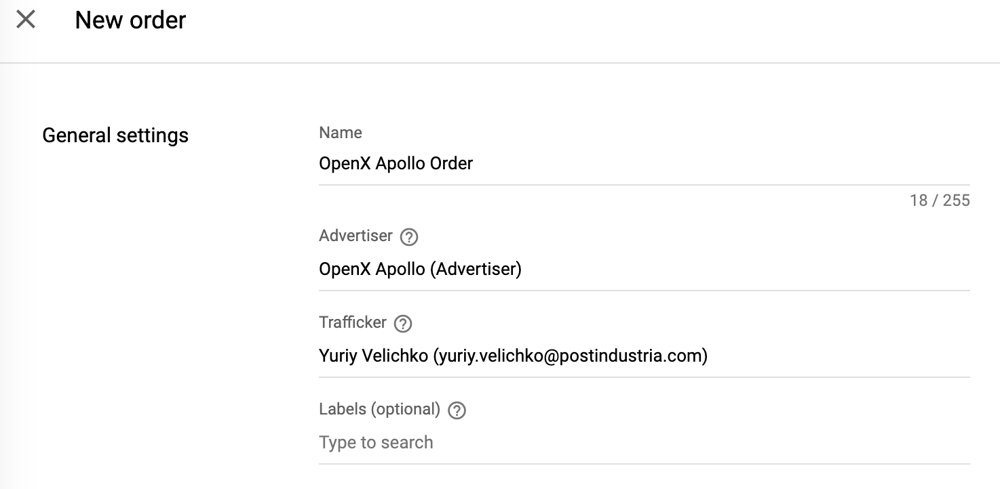

### Step 2: Create Line Item

To integrate the In-App Bidding into the app you have to create a Line Item with a specific price and targeting keyword.

Regardless of the ability to name a Line Item in any way we strongly suggest using the price or targeting keyword in the name. It will help you when you create a hundred of them.

#### Line Item Type

Create a Line Item depending on the type of expected creative kind.

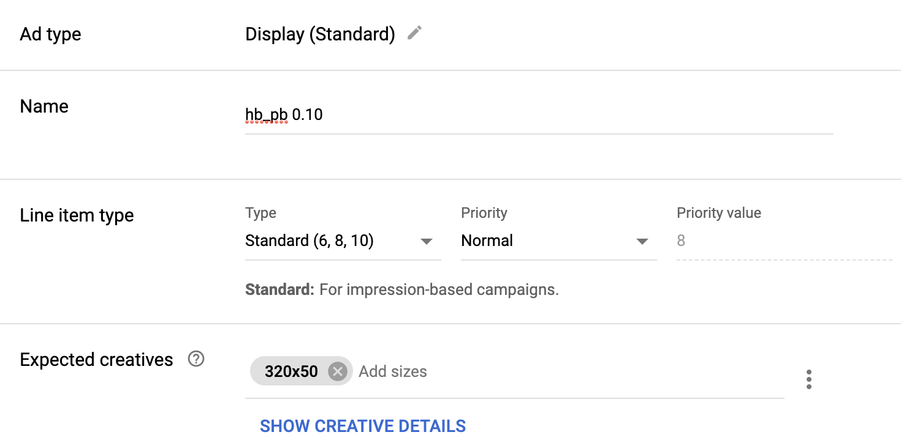

#### Line Item Price

The Line Item price should be chosen according to the price granularity policy.

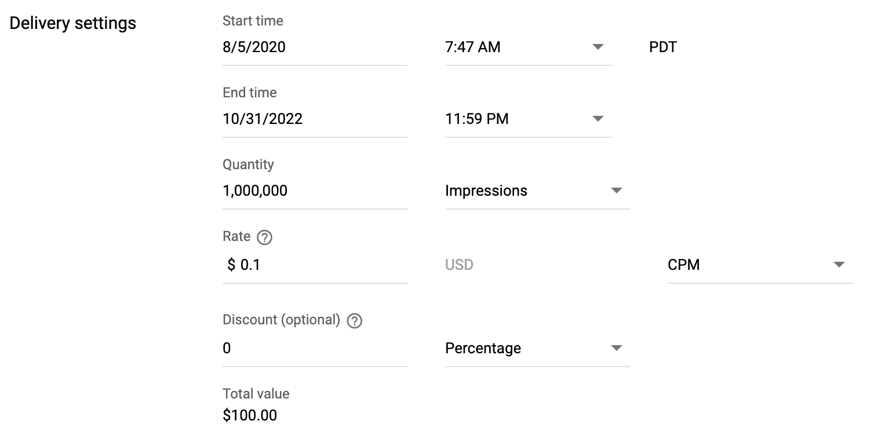

#### Line Item Targeting

The **Custom targeting** property should contain a special keyword with the price of winning bid. The same as a Rate of the Line Item.

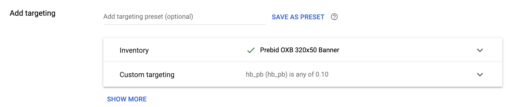


### Creative 

The In-App Bidding SDK renders the Apollo's bid when GAM SDK receives a creative with special meta information.  

#### Display Banner, Display Interstitial, Video Interstitial, Outstream Video.


The In-App Bidding Facade for GAM is based on [App Events](https://developers.google.com/ad-manager/mobile-ads-sdk/ios/banner#app_events) feature almost for all kinds of ads. That means that creative should contain a special tag that will be processed by GAM Event Handlers.

``` js
<script type="text/javascript" src="https://media.admob.com/api/v1/google_mobile_app_ads.js">
</script>
<script type="text/javascript">admob.events.dispatchAppEvent("oxbSdkAppEvent","");</script>
```

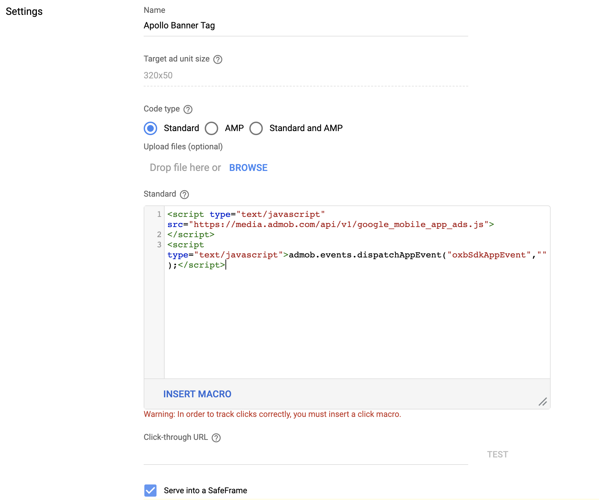


#### Rewarded Video

In-App Bidding facade for Rewarded video ads is based on [GADRewardedAdMetadataDelegate](https://developers.google.com/admob/ios/api/reference/Protocols/GADRewardedAdMetadataDelegate). So you need to set up a special VAST tag in the creative.

``` js
https://sdk.prod.gcp.openx.org/ads/inapp_bidding/gam_rewarded.xml
```

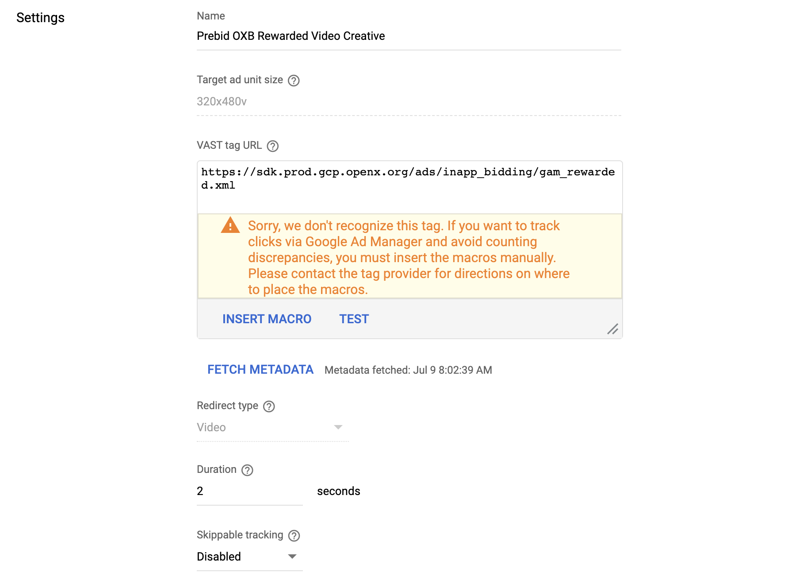

#### Native Styles

#### Step 1: Create a native ad
Go to `Google Ad Manager`, select `Delivery` > `Native`. Click `Create Native Ad`.

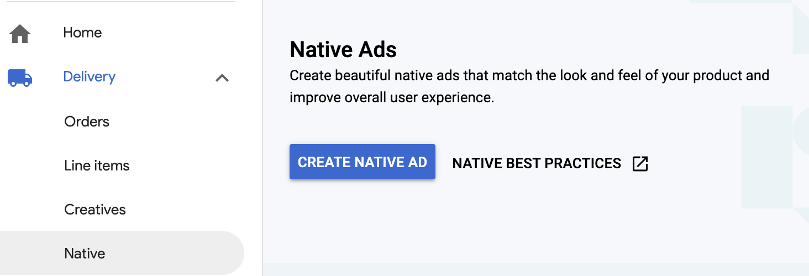

Select the `HTML & CSS editor` option.

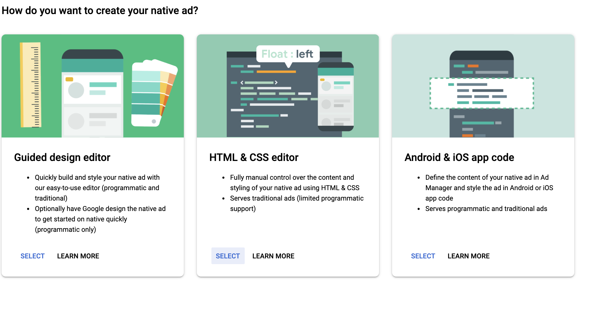


#### Step 2: Define ad settings

For Ad size you can specify a specific size for the ad unit or specify the `fluid` size.

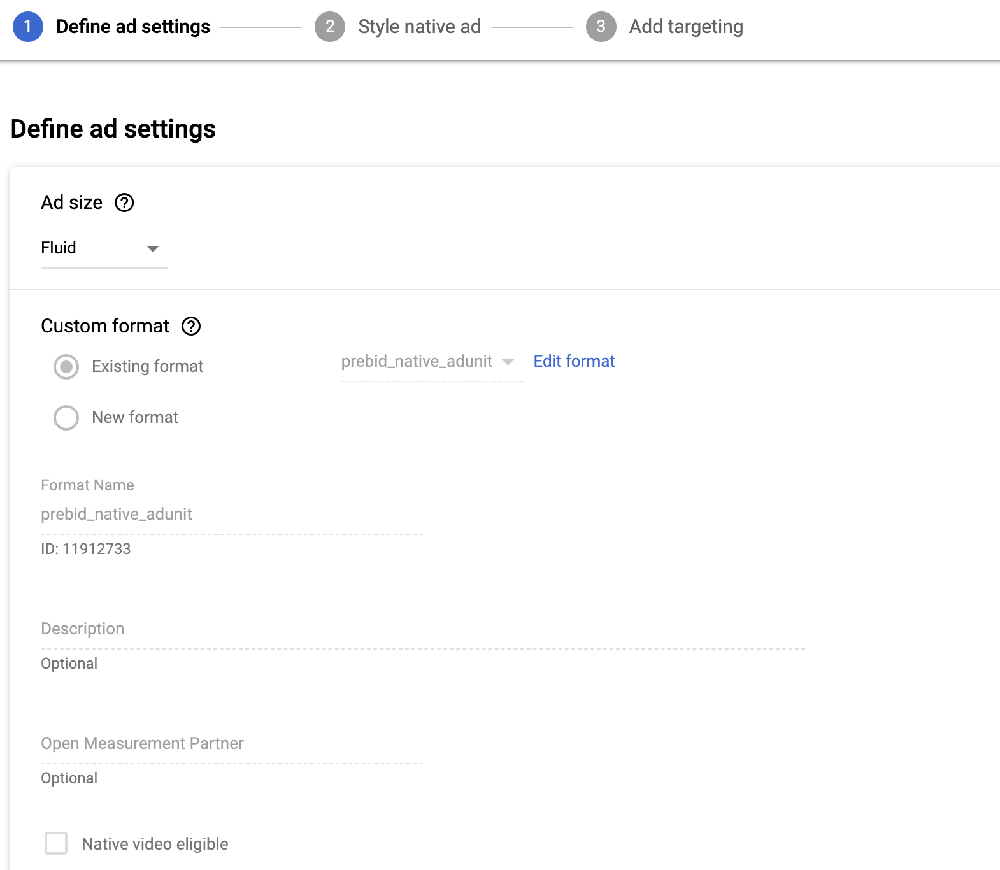

#### Step 3: Style your native ad

You can add HTML and CSS to define your native ad template.

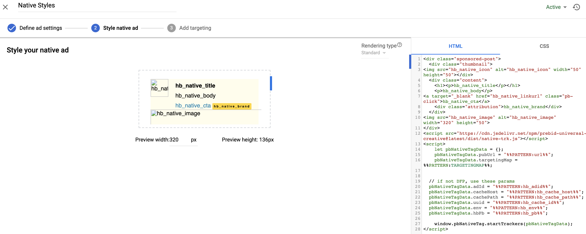

Example HTML:

``` html
<div class="sponsored-post">
  <div class="thumbnail">
</div>
  <div class="content">
    <h1><p>hb_native_title</p></h1>
    <p>hb_native_body</p>
<a target="_blank" href="hb_native_linkurl" class="pb-click">hb_native_cta</a>
    <div class="attribution">hb_native_brand</div>
  </div>

</div>
<script src="https://cdn.jsdelivr.net/npm/prebid-universal-creative@latest/dist/native-trk.js"></script>
<script>
  let pbNativeTagData = {};
  pbNativeTagData.pubUrl = "%%PATTERN:url%%";
  pbNativeTagData.targetingMap = %%PATTERN:TARGETINGMAP%%;

  window.pbNativeTag.startTrackers(pbNativeTagData);
</script>
```

Example CSS:

``` css
.sponsored-post {
    background-color: #fffdeb;
    font-family: sans-serif;
}

.content {
    overflow: hidden;
}

.thumbnail {
    width: 50px;
    height: 50px;
    float: left;
    margin: 0 20px 10px 0;
    background-size: cover;
}

h1 {
    font-size: 18px;
    margin: 0;
}

a {
    color: #0086b3;
    text-decoration: none;
}

p {
    font-size: 16px;
    color: #000;
    margin: 10px 0 10px 0;
}

.attribution {
    color: #000;
    font-size: 9px;
    font-weight: bold;
    display: inline-block;
    letter-spacing: 2px;
    background-color: #ffd724;
    border-radius: 2px;
    padding: 4px;
}
```

#### Step 4: Create new order and line items
Refer to the [Step 1: Create New Order](#step-1-create-new-order)


### Automatic


In order to implement proper [price granularity](http://prebid.org/prebid-mobile/adops-price-granularity.html#autoGranularityBucket) you have to create more than a hundred of Line items. You can do it manually or using free Chrome extension [PubMonkey](https://chrome.google.com/webstore/detail/pubmonkey/cjbdhopmleoleednpeaknmmbepfkhaml?hl=en). 

#### Setup Order Properties

To generate an Order just need to set generic parameters and custom creative code:

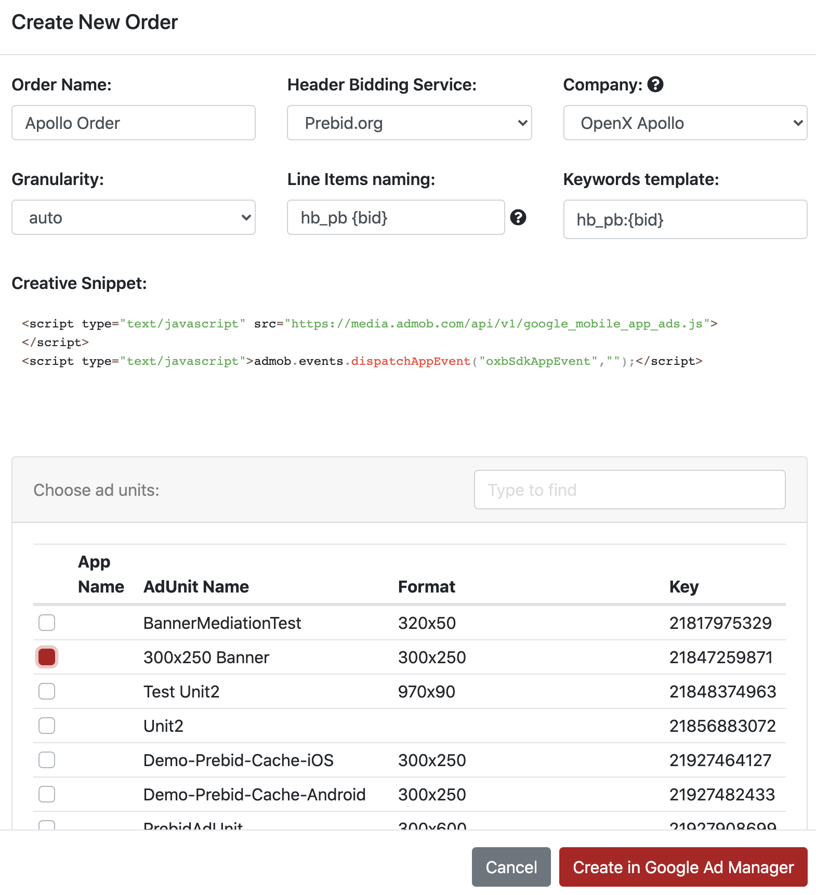


#### Inspect the Line Items

After a few minutes the Order with **170 Line Items** is ready to work:

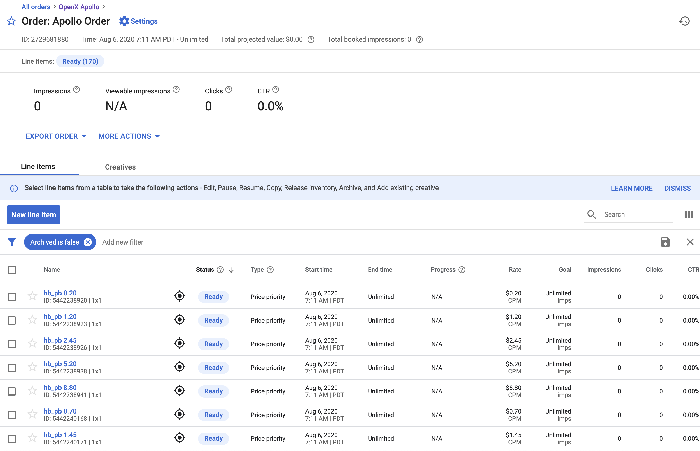


