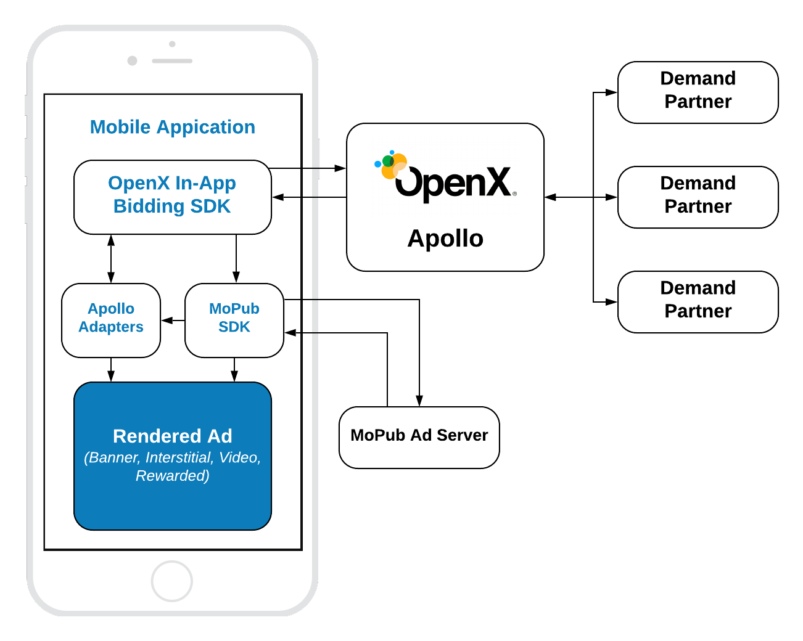

# MoPub Integration

## Table of Contents

1. [SDKs integration](#SDKs-integration)
2. [Order setup](#Order-setup)
3. [Mobile API](#Mobile-API)
    - [Init SDK](#Init-In-App-Bidding-SDK)
    - [Banner](#Banner-API)
    - [Native](ios-in-app-bidding-mopub-native-integration.md)
    - [Interstitial](#Interstitial-API)
    - [Rewarded](#Rewarded-API)


## MoPub SDK Integration

The prerequisite of In-App Bidding integration with MoPub is an installed MoPub SDK. If you do not have MoPub SDK in the app yet, refer to the [MoPub's Documentation](https://github.com/mopub/mopub-ios-sdk) for the integration process. The In-App Bidding SDK was tested with **MoPub SDK 5.13.0**.

⚠️⚠️⚠️ **WARNING**: MoPub Adapters for the Apollo SDK is compatible with **MoPub 5.13** and above. The ads won't be shown with earlier versions of MoPub SDK. 

If you have any troubles with integration contact [OpenX Support](https://docs.openx.com/Content/support.html).


## Order Setup 

To integrate header bidding into MoPub you have to prepare a specific Order following the [instructions](ios-in-app-bidding-mopub-order-setup.md) for particular ad kind.

## Mobile API

The integration of header bidding into MoPub monetization is based on MoPub's Mediation feature. 




OpenX In-App Bidding SDK provides ability to integrate header bidding for these ad kinds:

- Display Banner
- Display Interstitial
- [Native Styles](../integration-mopub/ios-in-app-bidding-mopub-native-integration.md)
- Video Interstitial 
- Rewarded Video

However, In-App Bidding facade for MoPub provides only three types of API classes for these ads:

- **Banner API** - for **Display Banner** 
- **Interstitial API** - for **Display** and **Video** Interstitials
- **Rewarded API** - for **Rewarded Video**

To create an Apollo account and start to use the SDK, visit the [OpenX Apollo](https://www.openx.com/prebid/) page first.

### Init the In-App Bidding SDK

To start running bid requests you have to provide an Account Id for your organization in Apollo server to the SDK:

```
OXASDKConfiguration.singleton.accountID = YOUR_ACCOUNT_ID
```

The best place to do it is the `application:didFinishLaunchingWithOptions` method.

The account ID is an identifier of the **Stored Request** of your organization on the Apollo UI. 

### Add In-App Bidding Adapters

Adapters for In-App bidding SDK are wrapped into a framework and serves like proxies between MoPub SDK and Apollo SDKs. For more details about Mediation and Adapters read the [MoPub's Documentation](https://developers.mopub.com/networks/integrate/mopub-network-mediation-guidelines/).

The framework could be added to the app via CocoaPods:

```
pod 'openx-apollo-mopub-adapters'
```

Or you can [download](http://sdk.prod.gcp.openx.org/apollo/ios/event-handlers/MoPub/1.1.0/OpenX_Apollo_MoPub_Adapters_iOS_1.1.0.zip) it manually and add as any other regular framework. MoPub SDK will eventually instantiate and use adapter classes in runtime.


### Banner API

To display an ad you need to implement three easy steps:


``` swift
// 1. Create an AdView
banner = MPAdView(adUnitId: MOPUB_AD_UNIT_ID)
banner.delegate = self

// 2. Create an In-App Bidding Ad Unit
adUnit = OXAMoPubBannerAdUnit(configId: APOLLO_CONFIG_ID, size: adSize)
    
// 3. Run an Header Bidding auction on Apollo
adUnit.fetchDemand(with: banner!) { [weak self] result in
    
     // 4. Load an Ad
    self?.banner.loadAd()
}
```

#### Step 1: Create Ad View

In the scenario with MoPub integration the MoPub's SDK plays the central role in managing ad views in the application's UI. You have to create and place MoPub's Ad View into the app page. If the winning bid on Apollo wins in the MoPub waterfall it will be rendered via Mediation in the place of original MoPub's Ad View by Apollo SDK.


#### Step 2: Create Ad Unit

Create the **OXAMoPubBannerAdUnit** object with parameters:

- **configId** - an ID of Stored Impression on the Apollo server
- **size** - the size of the ad unit which will be used in the bid request.

#### Step 3: Fetch Demand

To run an auction on Apollo run the `fetchDemand()` method which performs several actions:

- Makes a bid request to Apollo
- Sets up the targeting keywords to the MoPub's ad unit
- Passes the winning bid to the MoPub's ad unit
- Returns the result of bid request for future processing

#### Step 4: Load the Ad

When the bid request has completed, the responsibility of making the Ad Request is passed to the publisher. That is why you have to invoke `loadAd()` on the MoPub's Ad View explicitly in the completion handler of `fetchDemand()`.


#### Step 5: Rendering

If the Apollo bid wins on MoPub it will be rendered by `OXAMoPubBannerAdapter`. You don't have to do anything for this.  Just make sure that your order had been set up correctly and an adapter is added to the application target in the project. 

### Interstitial API

To display an ad you need to implement these easy steps:

``` swift
// 1. Create an MoPub's Interstitial Controller
interstitialController = MPInterstitialAdController.init(forAdUnitId: MOPUB_AD_UNIT_ID)
interstitialController.delegate = self

// 2. Create an In-App Bidding Interstitial Ad Unit
interstitialAdUnit = OXAMoPubInterstitialAdUnit(configId: APOLLO_CONFIG_ID,
                                                minSizePercentage: CGSize(width: 30, height: 30))
    
// 3. Run an Header Bidding auction on Apollo
interstitialAdUnit.fetchDemand(with: interstitialController!) { [weak self] result in
    
    // 4. Load an Ad
    self?.interstitialController.loadAd()
}

// .....

// 5. Show the ad
if interstitialController.ready {
    interstitialController.show(from: self)
}
```

The way of displaying **Video Interstitial Ad** is almost the same with two differences:

- Need customize the ad unit kind
- No need to set up `minSizePercentage`

``` swift
// 1. Create an MoPub's Interstitial Controller
interstitialController = MPInterstitialAdController.init(forAdUnitId: MOPUB_AD_UNIT_ID)
interstitialController.delegate = self

// 2. Create an In-App Bidding Interstitial Ad Unit
interstitialAdUnit = OXAMoPubInterstitialAdUnit(configId: APOLLO_CONFIG_ID,
                                                minSizePercentage: CGSize(width: 30, height: 30))
interstitialAdUnit.adFormat = .video
    
// 3. Run an Header Bidding auction on Apollo
interstitialAdUnit.fetchDemand(with: interstitialController!) { [weak self] result in
    
    // 4. Load an Ad
    self?.interstitialController.loadAd()
}
// .....

// 5. Show the ad
if interstitialController.ready {
        interstitialController?.show(from: self)
}
```


#### Step 1: Create Ad View

In the scenario with MoPub integration the MoPub SDK plays the central role in managing ad views in the application's UI. You have to create and place MoPub Ad View into the app page. If the winning bid on Apollo wins in the MoPub waterfall it will be rendered via Mediation in the place of original MoPub Ad View by Apollo SDK.


#### Step 2: Create Ad Unit

Create the **OXAMoPubInterstitialAdUnit** object with parameters:

- **configId** - an ID of Stored Impression on the Apollo server

#### Step 3: Fetch Demand

To run an auction on Apollo run the`fetchDemand()` method which performs several actions:

- Makes a bid request to Apollo
- Sets up the targeting keywords to the MoPub's ad unit
- Passes the winning bid to the MoPub's ad unit
- Returns the result of bid request for future processing

#### Step 4: Load the Ad

When the bid request has been completed the responsibility of making the Ad Request is passed on the publisher. That is why you have to invoke the `loadAd()` on the MoPub Ad View explicitly in the completion handler of the `fetchDemand()`.


#### Step 5: Rendering

If the Apollo bid wins on MoPub it will be rendered by `OXAMoPubInterstitialAdapter`. You do not have to do anything for this.  Just make sure that your order had been set up correctly and an adapter is added to the application target in the Xcode project 


However, due to the expiration, the ad could become invalid with time. So it is always useful to check it with `interstitialController?.isReady` before display.


### Rewarded API

To display an ad you need to implement these easy steps:


``` swift
// 1. Create an In-App Bidding Interstitial Ad Unit
rewardedAdUnit = OXAMoPubRewardedAdUnit(configId: APOLLO_CONFIG_ID)
    
// 2. Run an Header Bidding auction on Apollo
let bidInfoWrapper = OXAMoPubBidInfoWrapper()
rewardedAdUnit.fetchDemand(with: bidInfoWrapper) { [weak self] result in
    guard let self = self else {
        return
    }
    
    // 3. Load an Ad
    MPRewardedVideo.setDelegate(self, forAdUnitId: self.MOPUB_AD_UNIT_ID)
    MPRewardedVideo.loadAd(withAdUnitID: self.MOPUB_AD_UNIT_ID,
                           keywords: bidInfoWrapper.keywords as String?,
                           userDataKeywords: nil,
                           customerId: "testCustomerId",
                           mediationSettings: [],
                           localExtras: bidInfoWrapper.localExtras)
}

/// .......

// 4. Try to Display an Ad
if MPRewardedVideo.hasAdAvailable(forAdUnitID: MOPUB_AD_UNIT_ID) {
    let rewards = MPRewardedVideo.availableRewards(forAdUnitID: MOPUB_AD_UNIT_ID)
    guard let reward = rewards?.first as? MPRewardedVideoReward else {
        return
    }
    
    // 5. Present Ad
    MPRewardedVideo.presentAd(forAdUnitID: MOPUB_AD_UNIT_ID, from: self, with: reward, customData: nil)
}
```

#### Step 1: Create an Rewarded Ad Unit

Create the **OXARewardedAdUnit** object with parameter:

- **configId** - an ID of Stored Impression on the Apollo server

#### Step 2: Fetch Demand

To run an auction on Apollo run the `fetchDemand()` method which does several things:

- Makes a bid request to Apollo
- Sets up the targeting keywords to auxiliary class `OXAMoPubBidInfoWrapper`
- Returns the result of bid request for future processing

#### Step 3: Load the Ad

When the bid request has completed, the responsibility of making the Ad Request is passed to the publisher. That is why you have to invoke the `loadAd()` of the MoPub's Ad View explicitly in the completion handler of the `fetchDemand()`.


#### Step 5: Present the Rewarded Ad

If the Apollo bid wins on MoPub it will be rendered by `OXAMoPubRewardedVideoAdapter`. You do not have to do anything for this.  Just make sure that your order had been set up correctly and an adapter is added to the application target in the Xcode project 


