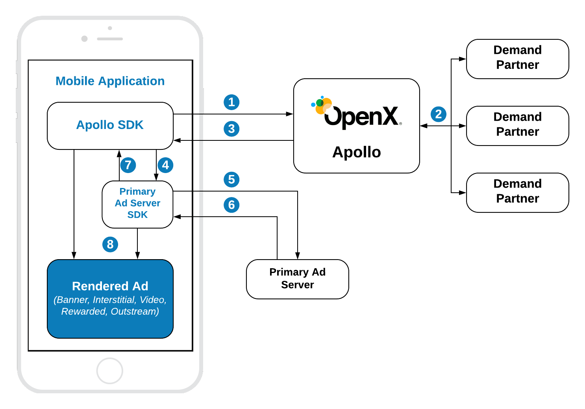
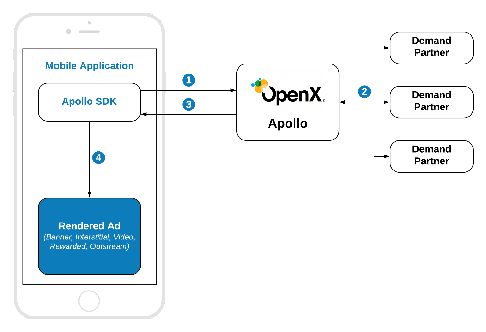
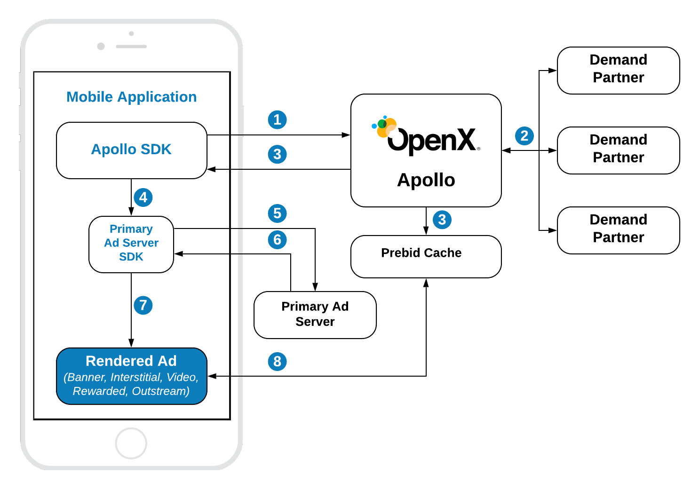

# Getting started with In-App Bidding


Apollo SDK provides access to the header bidding power hosted by OpenX. It allows publishers to increase the revenue by running a parallel auction on the server-side, inject the winning bid into the predefined waterfall and render premium ad formats with the best quality according to the latest industry standards. 

## Integration Scenarious 

There are three integration scenarios supported by Apollo SDK. 

- **With Primary Ad Server** when the winning bid is rendered by Apollo SDK but other ads are rendered by Primary Ad Server SDK.
- **Pure In-App Bidding** when there is no Primary ad server and the winning bid is rendered right after an auction on Apollo.
- **Vanilla Prebid Integration** when the winning bid is rendered by Prebid Universal Creative.

Below you can find their description and select the most suitable for your application.

  
### Apollo SDK with Primary Ad Server



1. Apollo SDK sends the bid request to the Apollo server.
2. Apollo server runs the header bidding auction among preconfigured demand partners.
3. Apollo Server responses with the winning bid that contains targeting keywords.
4. Apollo SDK sets up the targeting keywords of the winning bid to the ad unit of Primary Ad Server SDK.
5. Primary Ad Server SDK sends the ad request to the primary Ad Server
6. Primary Ad Server responds with an ad
7. The info about the winning ad is passed to the Apollo SDK
8. Depending on the ad response Apollo SDK renders the winning bid or allows Primary Ad Server SDK to show its own winning ad.

### Pure In-App Bidding



1. Apollo SDK sends the bid request to the Apollo server.
2. Apollo server runs the header bidding auction among preconfigured demand partners.
3. Apollo Server responses with the winning bid that contains targeting keywords.
4. Apollo SDK renders the winning bid.


### Vanilla Prebid Integration



1. Apollo SDK sends the bid request to the Apollo server.
2. Apollo server runs the header bidding auction among preconfigured demand partners.
3. Apollo Server responses with the winning bid that contains targeting keywords.
4. Apollo SDK sets up the targeting keywords of the winning bid to the ad unit of Primary Ad Server SDK.
5. Primary Ad Server SDK sends the ad request to the primary Ad Server
6. Primary Ad Server responds with an ad
7. Primary Ad Server SDK loads the ad with Prebid Universal Creative into the WebView
8. Prebid Universal Creative loads the winning bid from the Prebid Cache and renders it.


## Supported Ad Formats

Apollo SDK supports next ad formats:

 - Display Banner
 - Display Interstitial
 - Video Interstitial
 - Rewarded Video
 - Outstream Video (for GAM and Pure In-App Bidding)
 - Native Styles Ads
 - Native Ads

## Apollo Setup

To start running header bidding auction you need to register on Apollo and create respective configurations for organization and ad units. To create an Apollo account, visit the [OpenX Apollo](https://www.openx.com/prebid/) page first.

Before integrating the Apollo SDK you will need next keys:

- **Apollo Account ID** - an identifier of the **Stored Request** of your organization on the Apollo UI.
- **Configuration ID** - an identifier of the **Stored Impression** which contains information about bidders for a particular ad unit. You need as many ids as many different ad units you want to integrate.

## Init Apollo SDK

Firstly import Apollo:

```
import OpenXApolloSDK
```

Then provide the **Apollo Account ID** of your organization. The best place to do it is the `application:didFinishLaunchingWithOptions` method.
 
```
OXASDKConfiguration.singleton.accountID = YOUR_ACCOUNT_ID
```

Now you are ready to integrate ad units.


## Integration Scenarios and Tips


Depending on Primary Ad Server used, In-App Bidding SDK supports these kinds of integration:

- With [Google Ad Manager (GAM)](integration-gam/ios-in-app-bidding-gam-info.md) as a Primary Ad Server
- With [MoPub](integration-mopub/ios-in-app-bidding-mopub-info.md) as a Primary Ad Server
- [Pure In-App Bidding](integration-apollo/ios-in-app-bidding-pb-info.md) as an integration without Primary Ad Server
  

## Integration Tips


**Integration Features and Tips:**

- To inspect the code integration download and run a [Demo Appication] ()
- [iOS App Transport Security (ATS)](ios-sdk-ats.md)
- [Testing and troubleshooting](ios-sdk-self-test.md)


