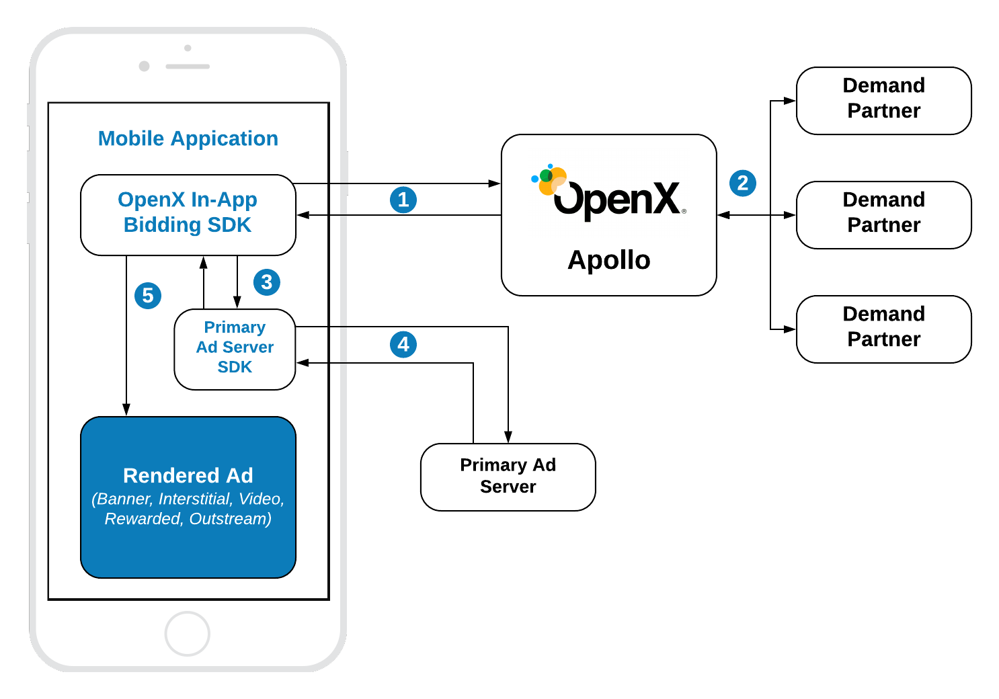

# Getting started with In-App Bidding


The In-App Bidding SDK provides access to the header bidding power hosted by OpenX. It allows publishers to increase the revenue by running a parallel auction on the server-side, inject a winning bid into the predefined waterfall and render premium ad formats with the best quality according to the latest industry standards. 

## In-App Bidding Overview  




1. In-App Bidding SDK sends the bid request to the OpenX Apollo server.
2. Apollo server runs the header bidding auction among preconfigured demand partners.
3. In-App Bidding SDK sets up the targeting keywords of the winning bid to the ad unit of Primary Ad Server SDK.
4. Primary Ad Server SDK sends the ad request to the primary Ad Server
5. Depending on the ad response In-App Bidding SDK renders the winning bid or allows Primary Ad Server SDK to show its own winning ad in the internal waterfall.  

> Note: steps 3 and 4 are relevant for the case of integration with Primary Add Server. In case of the Pure In-App Bidding scenario, the winning bid will be rendered immediately after it was received. 


## Supported Ad Formats

OpenX In-App Bidding SDK supports next premium ad formats:

 - Display Banner
 - Display Interstitial
 - Video Interstitial
 - Rewarded Video
 - Outstream Video (for GAM and Pure In-App Bidding)

## Apollo Setup

To start running header bidding auction you need to register on Apollo server and create configurations for ad units and demand partners. To create an Apollo account and start to use the SDK, visit the [OpenX Apollo](https://www.openx.com/prebid/) page first.

Before the integration of the In-App Bidding SDK you should have:

- **Apollo Account ID** - an identifier of the **Stored Request** of your organization on the Apollo UI.
- **Configuration ID** - an identifier of the **Stored Impression** which contains information about bidders for a particular ad unit in the app. You need as many ids as many different ad units you want to integrate.


## Init Apollo SDK

To use In-App Bidding SDK you need to import the Apollo library into source files:

```
import OpenXApolloSDK
```

To start running bid requests you have to provide the SDK an Account Id for your organization on Apollo server 

```
OXASDKConfiguration.singleton.accountID = YOUR_ACCOUNT_ID
```

The best place to do it is the `application:didFinishLaunchingWithOptions` method. The account ID is an identifier of the **Stored Request** of your organization on the Apollo UI. 


## Integration Scenarios and Tips


Depending on Primary Ad Server used, In-App Bidding SDK supports these kinds of integration:

- With [Google Ad Manager (GAM)](integration-gam/ios-in-app-bidding-gam-info.md) as a Primary Ad Server
- With [MoPub](integration-mopub/ios-in-app-bidding-mopub-info.md) as a Primary Ad Server
- [Pure In-App Bidding](integration-pb/ios-in-app-bidding-pb-info.md) as an integration without Primary Ad Server
  

## Integration Tips


**Integration Features and Tips:**

- To inspect the code integration download and run a [Demo Appication] ()
- [iOS App Transport Security (ATS)](ios-sdk-ats.md)
- [Testing and troubleshooting](ios-sdk-self-test.md)


