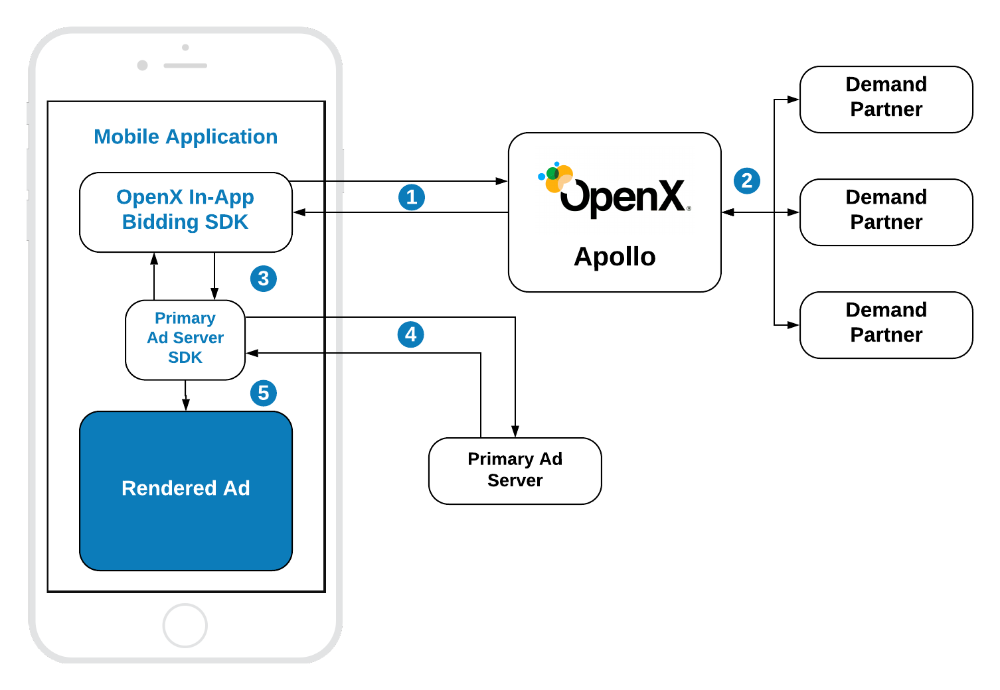
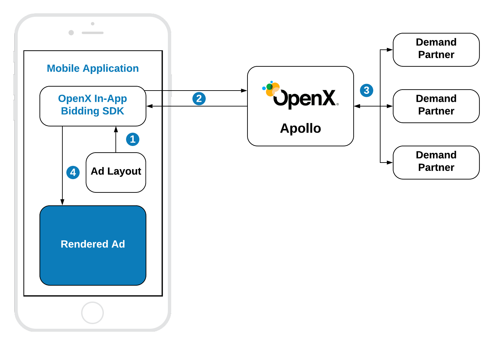

# Native Ads Guidelines

Apollo SDK, starting from the version 1.1, supports Native Styles ads. The support of Unified Native Ads is scheduled for the next release.

## Getting Started

Apollo SDK implements the [OpenRTB Specification](https://www.iab.com/wp-content/uploads/2018/03/OpenRTB-Native-Ads-Specification-Final-1.2.pdf) for the native ads.

The general integration scenario requires these steps from publishers:

1. Prepare the ad layout:
    * HTML and CSS for the Native Styles format.
    * Native components for the Unified Ads format *(not supported yet)*.
1. Configure the Native Ad using [OXANativeAdConfiguration](ios-sdk-native-configuration.md).
    * Provide the list of **[Native Assets](#Components)** representing the ad's structure.
    * Tune other general properties of the ad.
1. Make a bid request.
1. [OPTIONAL] Bind the data from the bid response with the layout, if it is needed for particular integration.

### Native Styles

Apollo SDK supports the prebid's approach for rendering [native ads](https://docs.prebid.org/prebid-mobile/pbm-api/ios/pbm-nativeadunit-ios.html). It is similar to the Google's [Native Styles](ios-in-app-bidding-native-guidelines-info) ad format. In this case publisher should preare the layout of the ad using HTML and CSS and add the universal creative to the ad code. 

1. Apollo SDK sends the bid request.
2. Apollo server runs the header bidding auction among preconfigured demand partners.
3. In-App Bidding SDK sets up the targeting keywords of the winning bid to the ad unit of Primary Ad Server SDK.
4. Primary Ad Server SDK sends the ad request to the Ad Server. If Apollo's line item wins the ad response will contain **Prebid Universal Creative** and **Ad Layout**.  
5. The received creative will be rendered in the Web View of Primary Ad Server SDK.  

The ad will be rendered in the web view. The rendering engine will be the prebid's universal creative. It will load the winning bid from the prebid cache and substitute assets into the ad markup. For the more detailed info visit the Prebid's instructions about [How Native Ads Work](https://docs.prebid.org/dev-docs/show-native-ads.html#how-native-ads-work).

In order to prepare the valid layout folow the instructions in the Prebid docs for [Mobile in general](https://docs.prebid.org/prebid-mobile/adops-native-setup.html) and for [Google Ad Manager](https://docs.prebid.org/adops/setting-up-prebid-native-in-dfp.html). 

In the case of integration of Native Styles ads without Primary Ad Server publishers should provide the Ad Layout to the SDK. And the winning bid will be rendered right after receiving it from Apollo.

1. Setup layout for the Native Styles ad.
2. Apollo SDK sends the bid request.
3. Apollo server runs the header bidding auction among preconfigured demand partners.
3. The received creative will be rendered in the Web View of Apollo SDK.  
 

### Unified Native Ads

The rendering using native components is not supported yet. This ad format is scheduled for the next version - **Apollo SDK 1.2**.

## Components

Apollo SDK supports all Native Ad components proclaimed by the OpenRTB specification: **title**, **image**, **video**, **data**. 

We strogly recomend to follow the industry best practices and requirements, especialy in the case of integration with Primary Ad Server:

* [OpenRTB Specification]([OpenRTB Specification](https://www.iab.com/wp-content/uploads/2018/03/OpenRTB-Native-Ads-Specification-Final-1.2.pdf))
* [The Native Advertizing Playbook](https://www.iab.com/wp-content/uploads/2015/06/IAB-Native-Advertising-Playbook2.pdf)
* [Google Guidelines](https://support.google.com/admanager/answer/6075370)
* [MoPub Guidelines](https://developers.mopub.com/publishers/best-practices/native-ads/)

While preparing the layout for Native Ads, account for the **AdChoices** button placed at the **top right corner** with a size of **20x20** points.

## Integration 

Apollo SDK allows to integrate native ads into all supported scenarios: 

* [Google Ad Manager](integration-gam/ios-in-app-bidding-gam-native-integration.md)
* [MoPub](integration-mopub/ios-in-app-bidding-mopub-native-integration.md)
* [Pure In-App Bidding](integration-apollo/ios-in-app-bidding-apollo-native-integration.md)
 