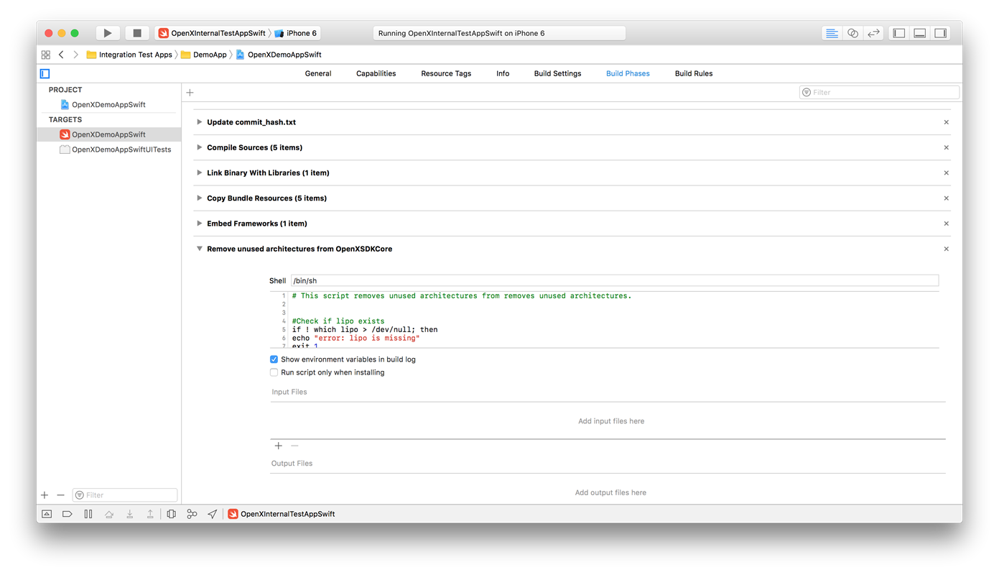

Submitting your app to App Store
================================

After you have performed the [self-test](ios-sdk-self-test.md), you can submit your app to the App Store. For ease of testing, OpenX distributes our `OpenXSDKCore` framework with support for both simulator and device architectures. However, the App Store will reject any apps that contain simulator architectures (i386 and x86\_64).

The demo apps bundled with the OpenX Mobile iOS SDK have a Run Script Phase that removes architectures that are not in use in your app from OpenXSDKCore.framework.

> **Important:** You must include this Run Script Phase in your application to avoid rejection by the App Store.

To install the Run Script Phase:

1.  Click the \"+\" sign underneath **General**.
2.  Select **New Run Script Phase**.
3.  Copy and paste the contents of the \"Remove unused architectures from OpenXSDKCore\" Run Script Phase from one of the demo apps into your new Run Script Phase.
4.  Make sure to order the build phases such that the Run Script Phase runs _after_ the Embed Frameworks Phase as shown below, or it will be ineffective.

